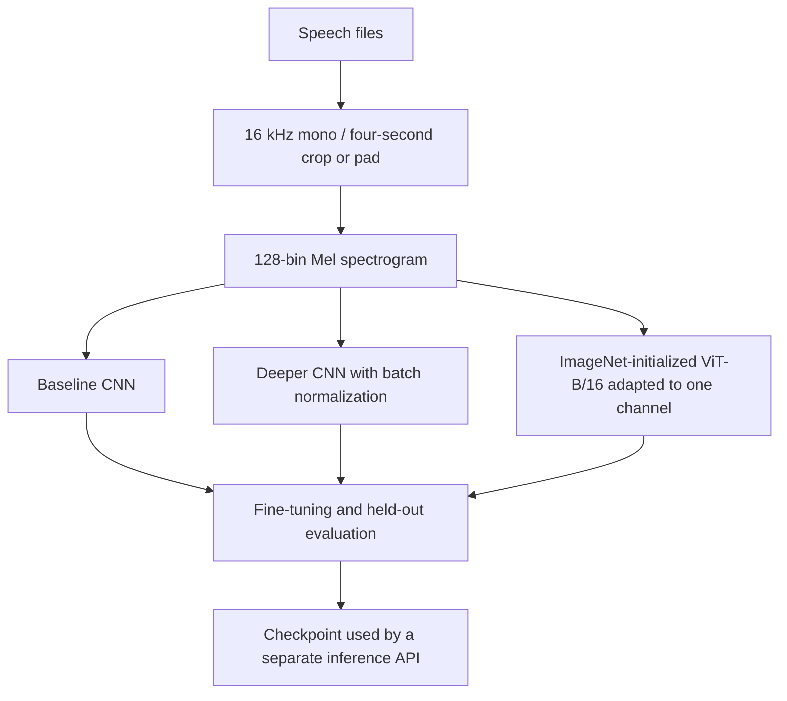

# Voice Anti-Spoofing System

**Comparative deep learning for human-versus-generated speech.**

[Deployed web frontend](https://voiceantispoofing.netlify.app/) · [Web application source](https://github.com/Laabh-Gupta/Voice-Anti-Spoofing-Web-App) · [Model artifacts](https://huggingface.co/LaabhGupta/voice-antispoofing)

This project explores how Mel spectrograms, convolutional networks and a Vision Transformer distinguish real speech from synthesized speech. My work spans preprocessing, model comparison, augmented fine-tuning and a separate React/FastAPI serving application.

This repository is a **smaller variant of the original project**. Its notebooks expose the experimental method; the original-project performance figures below come from a separate evaluation, as confirmed by the author.

## Dataset & input

The experiments use [The Fake or Real Dataset](https://www.kaggle.com/datasets/mohammedabdeldayem/the-fake-or-real-dataset), including `for-original` and early `for-rerec` work. Obtain data under its applicable terms.

The fine-tuning notebook expects `training/`, `validation/` and `testing/` beneath its configurable `DATA_DIR`, with `fake/` and `real/` class directories. The committed configuration points to `prototyping_dataset`; set it explicitly for your local dataset.

## Method & architecture



The CNN baseline has three convolution blocks. The deeper CNN adds a fourth block and batch normalization. ViT inputs resize to 224×224; its input projection is adapted for one-channel spectrograms. Fine-tuning uses time/frequency masking, lower learning rates and gradient clipping.

This is task-specific classifier training and transfer learning. No foundation language model is trained here.

## Evaluation

| Original-project model | Reported test accuracy |
| --- | ---: |
| Fine-tuned baseline CNN | **99.51%** |
| Fine-tuned deeper CNN | **99.63%** |
| Fine-tuned ViT | **99.75%** |

**Provenance:** these are the original project's final results, retained following the author's confirmation. This smaller repository contains saved outputs from other experiments, so running or reading those cells is not a reproduction of the table. The original final evaluation artifact is not bundled here.

The separate deployed web backend uses the **baseline CNN**. The ViT result should not be interpreted as the web app's measured production accuracy.

### Evaluation limits

Dataset composition, speaker/generator overlap, split construction and distribution shift affect generalization. No cross-dataset robustness, equal-error rate or production false-positive rate is claimed. The current helper averages batch accuracies and skips batches containing unreadable samples; audit those details before comparing runs. Some saved experiments contain non-finite losses.

## Explore & run

Use a Python environment with compatible PyTorch/Torchaudio/Torchvision versions and Jupyter. GPU acceleration is useful for training.

```bash
git clone https://github.com/Laabh-Gupta/Voice_Anti_Spoofing_System.git
cd Voice_Anti_Spoofing_System
python -m venv .venv
```

Activate the environment, then install the notebook dependencies:

```bash
python -m pip install torch torchaudio torchvision numpy matplotlib scikit-learn tqdm soundfile jupyterlab
jupyter lab
```

These notebooks do not provide a locked training environment. Select a PyTorch build appropriate to your hardware, set dataset paths, and check device/AMP compatibility before a long run.

| Notebook | Purpose |
| --- | --- |
| [FakeVsReal_1](FakeVsReal_1.ipynb) | Early data-loading and CNN experiments |
| [SamplingDataset](SamplingDataset.ipynb) | Create a smaller dataset for iteration |
| [FakeVsReal_2](FakeVsReal_2.ipynb) | Model definitions, training and evaluation |
| [FakeVsReal_2_FineTunning](FakeVsReal_2_FineTunning.ipynb) | Load checkpoints, augment and fine-tune |

Read notebook cells in order. Fine-tuning expects the initial checkpoint files to exist; dataset paths and checkpoints are not portable simply because the notebooks are committed.

For the current web setup, use the [application repository's run instructions](https://github.com/Laabh-Gupta/Voice-Anti-Spoofing-Web-App#run-locally). The `Baseline Web App/` and `ViT Web App/` folders here preserve earlier serving experiments.

## Demo


The [live frontend](https://voiceantispoofing.netlify.app/) connects to an inference service; availability and cold-start delays depend on hosting and model downloads.

## Stack & license

**Python · PyTorch · Torchaudio · Torchvision · scikit-learn · Jupyter**<br>
Serving companion: **FastAPI · React · Hugging Face Hub · Netlify · Render**.

[MIT license](LICENCE).
